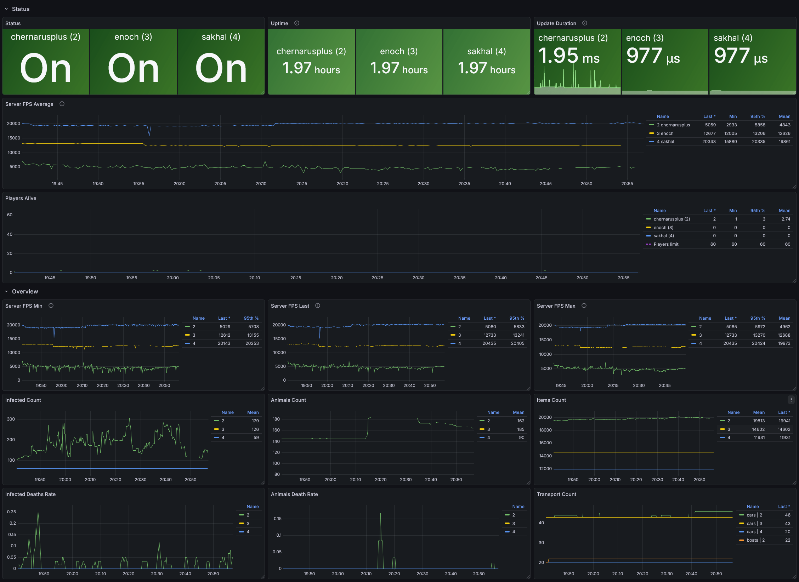
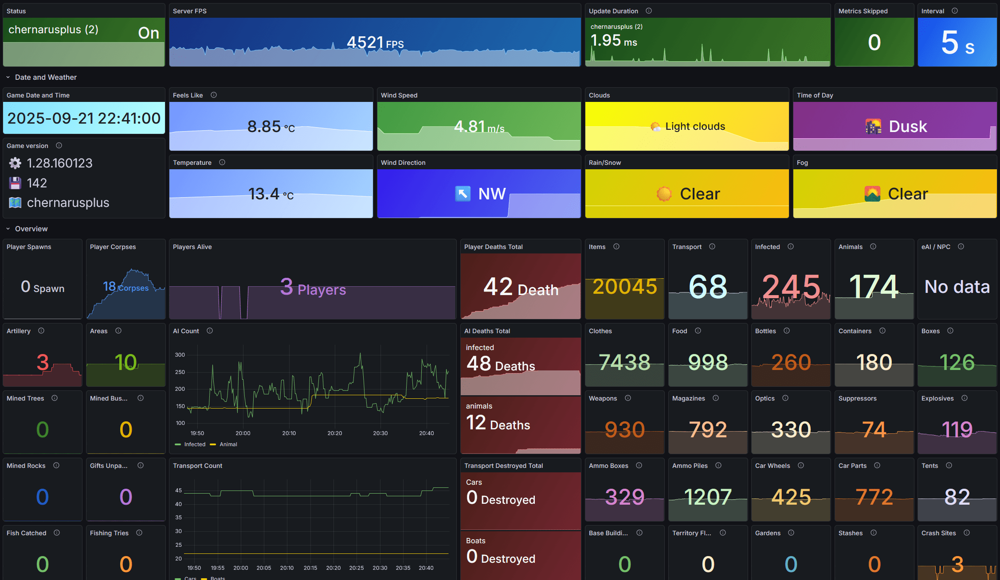
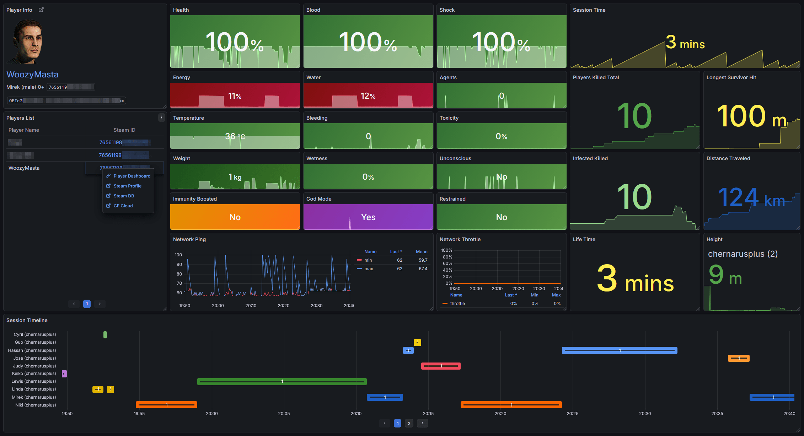
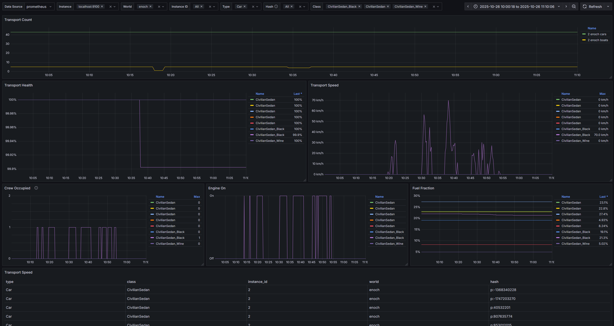

# MetricZ for DayZ Server

<!-- markdownlint-disable-next-line MD033 -->


DayZ server instrumentation via the Prometheus textfile collector
or direct HTTP Push.
The mod gathers engine and world metrics and exports them for monitoring.
Integrates seamlessly with node_exporter (Linux), windows_exporter (Windows),
or the specialized [MetricZ Exporter].

## Why

* Observe the server and game loop in DayZ.
* Server-side only. No client required. Works on vanilla servers.
* Low overhead: Mission timer and a single pass over entities per scrape tick.
* Flexible Export: Write to local file (Textfile Collector) or push via HTTP.
* Safety: atomic writes, buffered output, controlled label cardinality.
* Self-hosted: full control over your data.
* Free. Supporting the author is optional.

<!-- markdownlint-disable-next-line MD033 -->
<br clear="right"/>

> [!CAUTION]  
> This mod **only exports raw data**. Installing it will not magically make
> graphs appear in your admin panel.  
> To visualize this data, you must install and configure an observability stack:
>
> 1. **Collector:** `node_exporter`, `windows_exporter`, or `metricz-exporter`.
> 1. **Time Series Database:** `Prometheus`, `VictoriaMetrics` or `Mimir`.
> 1. **Visualization:** `Grafana`.
>
> If you have never worked with these tools, be prepared to read their
> documentation and spend time configuring the environment.

## Architecture

* **Hooks:** `DayZGame.OnRPC` and `OnEvent` (RPC/Event),
  `MissionServer` (init, scheduler, lifecycle),
  `MissionServer.OnUpdate` (FPS sampling).
* **Collectors:**
  * Player (`MetricZ_PlayerMetrics`) - vitals, position, network stats.
  * Transport (`MetricZ_TransportMetrics`) - speed, fuel, damage, passengers.
  * Territories & Bases (`MetricZ_TerritoryMetrics`, `MetricZ_Storage`).
  * AI & Environment (Zombies, Animals, Weather, EffectAreas).
  * Weapons & Ballistics (Shots, Hits by ammo type).
* **Sinks (Export):**
  * File: Writes to `$profile:metricz/export/` (atomic write via `.tmp` file).
  * HTTP: Pushes metrics to a remote endpoint via POST requests
    (chunked, with transaction support).
* **Format:** Prometheus text format (OpenMetrics compatible).
  * Prefix: `dayz_metricz_`.
  * Types: GAUGE/COUNTER.
  * Base labels: `world`, `instance_id`, `host` (not guaranteed).

> [!TIP]  
> It works best when combined with structured logs using the [LogZ] mod.
> While MetricZ handles performance counters, LogZ captures non-metric
> event data as structured NDJSON logs, enabling deeper tracing and analysis.

## Performance & Impact

MetricZ is designed with zero-impact philosophy in mind.
Monitoring should never lag the server.

### Time-Sliced Collection

Instead of freezing the server to count 10,000+ items and entities
in a single frame, MetricZ splits the scrape process into 12 separate steps.  
Each step executes in a separate server frame (tick).

* **Frame 1:** World data update & write.
* **Frame 2:** Iterate Players.
* **Frame 3:** Iterate Zombies.
* **Frame 4:** Iterate Animals.
* **Frame 5:** Iterate Vehicles...
* ...and so on.

This ensures that the "spikes" of CPU usage are flattened over a short period
(approx. 1-3 ms total), keeping the Server FPS stable.

### Event-Driven Counters

Global counters (like `weapons_total`, `items_total`)
do not iterate over objects.
They use O(1) hooks (`EEInit`/`EEDelete`) to maintain a live count in memory.
Reading these values is instant.

### String Caching

String manipulation in DayZ (Enforce Script) is slow.
MetricZ caches normalized label names and metric prefixes.
e.g., The raw label `{world="chernarus",...}` is built once and reused.
Object names like `M4A1_Green` -> `m4a1` are resolved once per type and cached.

### Smart I/O

* **File Export:**
  Uses buffered writing
  (only flushes to disk when buffer fills, typically 4KB-64KB chunks).
* **HTTP Export:**
  Uses serialized JSON payloads to avoid creating massive strings in memory.

> [!TIP]  
> Use HTTP export with [MetricZ Exporter], it is often 10 times faster
> than file export and also enriches your metrics with more information.

## Quick start

By default, the mod writes to a file for use with a local exporter
(node_exporter or windows_exporter).

* Path: `$profile:metricz/export/metricz_{instance_id}.prom`.
* Config: `$profile:metricz/config.json` (created on first run).
* Frequency: Defined by `collect_interval_sec` (default 15s).

Example content:

```PromQL
# HELP dayz_metricz_players_online Total players online in the world
# TYPE dayz_metricz_players_online gauge
dayz_metricz_players_online{world="chernarusplus",host="dz01",instance_id="1"} 24
```

Details: [METRICS.md](./METRICS.md)

## Mod configuration

> [!IMPORTANT]  
> On the same host (ideally, across all servers)
> every server must have a unique `instanceId`.  
> If multiple servers run the same map (`world`), time series will collide.  
> Base labels are `{world, instance_id}`.
> Ensure `instanceId` is unique per server in `serverDZ.cfg`;
> together with the map name it forms metric identity.

Settings are stored in `$profile:metricz/config.json`.
The mod automatically migrates the config version if updated.

Detailed information about all configuration parameters
can be found in the document [CONFIG.md](./CONFIG.md)

### Recommendations

* Interval: Keep `collect_interval_sec` at 15s or higher on busy servers.
* Concurrency: If you see "scrape skipped" warnings, increase the interval.
* Exporter: Align your [node_exporter]/[windows_exporter]
  scrape interval with `collect_interval_sec`.

## Prometheus integration: File Export

Assuming your server profiles are in `/dayz-server-dir/profiles/`.
The metrics are now generated inside a subdirectory `metricz/export/`.

> [!TIP]  
> Instead of symlinks, you can mount the entire `$profile/metricz/export/`
> directory as a separate volume.
>
> * **RAM Disk:** Mount it to RAM to reduce SSD wear
>   (MetricZ rewrites the file every 15s).
> * **Docker:** Mount a shared volume between the DayZ container
>   and the Node Exporter container.

### Linux (Symlinks method)

Shared directory with symlinks:

```bash
mkdir -p /dayz-server-dir/profiles/metrics_collector
# Link the specific .prom file from the export subdirectory
ln -s ../profile_1/metricz/export/metricz_1.prom /dayz-server-dir/profiles/metrics_collector/metricz_1.prom
ln -s ../profile_2/metricz/export/metricz_2.prom /dayz-server-dir/profiles/metrics_collector/metricz_2.prom
```

Start node_exporter:

```bash
/usr/local/bin/node_exporter \
  --collector.textfile.directory=/dayz-server-dir/profiles/metrics_collector
```

`prometheus.yml`:

```yaml
scrape_configs:
  - job_name: dayz_node
    static_configs:
      - targets: ['node-exporter-host:9100']
```

### Windows (Symlinks method)

The file path structure is: `C:\dayz-server\profiles\profile_1\metricz\export\metricz_1.prom`.

Shared directory with links:

```cmd
mkdir C:\dayz-server\profiles\metrics_collector
mklink C:\dayz-server\profiles\metrics_collector\metricz_1.prom C:\dayz-server\profiles\profile_1\metricz\export\metricz_1.prom
mklink C:\dayz-server\profiles\metrics_collector\metricz_2.prom C:\dayz-server\profiles\profile_2\metricz\export\metricz_2.prom
```

`windows_exporter` (textfile collector):

MSI Arguments:

```powershell
msiexec /i windows_exporter.msi --% ENABLED_COLLECTORS="[defaults],textfile" `
  TEXTFILE_DIRS="C:\dayz-server\profiles\metrics_collector"
```

YAML Config:

```yaml
collectors:
  enabled: "[defaults],textfile"
collector:
  textfile:
    directories:
      - "C:\\dayz-server\\profiles\\metrics_collector"
```

## HTTP Export & Enrichment

MetricZ supports pushing metrics directly to a dedicated backend service.
We provide a specialized cross-platform Go backend: [MetricZ Exporter].

This service goes beyond simple ingestion; it acts as a bridge to enrich
your data with information not available to the Game Script API.

### Features of MetricZ Exporter

1. Ingestion: Accepts chunked metrics and transaction groups sent
  by the mod (lowering memory pressure on the game server).
1. Steam A2S_INFO: Enriches metrics with real-time Steam Query data:
    * Server Name and Description.
    * Player Queue length (crucial for monitoring full servers).
1. BattlEye RCon: Enriches player metrics with administrative data:
    * IP Addresses and GeoIP location data.
    * BattlEye GUID (appended to the existing DayZ GUID and SteamID).

### Setup

1. Download and run [metricz-exporter] on your server or a separate machine.
1. In `$profile:metricz/config.json`, set:
    * `file.enabled`: `false`
    * `http.enabled`: `true`
    * `http.url`: `http://your-exporter-ip:8098`
    * `http.user` / `http.password`:
      (If authentication is configured in the exporter).

See [CONFIG.md](./CONFIG.md) for detailed mod configuration.

## Dashboards (Grafana)

| MetricZ Servers Overview                                    |
| :---------------------------------------------------------: |
|           |
| [grafana.com](https://grafana.com/grafana/dashboards/24291) |
| Dashboard ID: `24291`                                       |
| [Dashboard JSON](grafana/dashboards/servers-overview.json)  |

---

| MetricZ Server Details                                      |
| :---------------------------------------------------------: |
|                        |
| [grafana.com](https://grafana.com/grafana/dashboards/24290) |
| Dashboard ID: `24290`                                       |
| [Dashboard JSON](grafana/dashboards/server.json)            |

---

| MetricZ Player Stats                                        |
| :---------------------------------------------------------: |
|                        |
| [grafana.com](https://grafana.com/grafana/dashboards/24289) |
| Dashboard ID: `24289`                                       |
| [Dashboard JSON](grafana/dashboards/player.json)            |

---

| MetricZ Transport Stats                                     |
| :---------------------------------------------------------: |
|                   |
| [grafana.com](https://grafana.com/grafana/dashboards/24292) |
| Dashboard ID: `24292`                                       |
| [Dashboard JSON](grafana/dashboards/transport.json)         |

## Mod support

Built-in support for modifications:

* [DayZ-Expansion-AI] (AI & AI NPC counts and deaths)
* [DayZ-Expansion-Vehicles] (Boats, Helicopters, Planes categorization)

## Mod Integration (for modders)

See: [INTEGRATION.md](./INTEGRATION.md)

Covers:

* Optional `#ifdef METRICZ` integration.
* Adding custom metrics using `MetricZ_Storage`.
* Hooking into player actions or item interactions.

## Debugging

* Enable `-dologs` and `-filePatching` if needed.
* For detailed tracing, use `DayZDiag_x64.exe`.
  The mod contains `#ifdef DIAG` blocks that output detailed execution traces
  (configuration load, sink operations, HTTP callbacks) to the script log.

## 👉 [Support Me](https://gist.github.com/WoozyMasta/7b0cabb538236b7307002c1fbc2d94ea)

If this mod has saved you hours of time debugging server performance,
analyzing player activity, or identifying bottlenecks,
please consider supporting me.  
At the very least, a Like and Subscribe on the [MetricZ]
Steam Workshop page would be greatly appreciated!

<!-- Links --->
[MetricZ Exporter]: https://github.com/WoozyMasta/metricz-exporter
[node_exporter]: https://github.com/prometheus/node_exporter
[windows_exporter]: https://github.com/prometheus-community/windows_exporter

[LogZ]: https://steamcommunity.com/sharedfiles/filedetails/?id=3610709966
[MetricZ]: https://steamcommunity.com/sharedfiles/filedetails/?id=3594119002
[DayZ-Expansion-AI]: https://steamcommunity.com/sharedfiles/filedetails/?id=2792982069
[DayZ-Expansion-Vehicles]: https://steamcommunity.com/sharedfiles/filedetails/?id=2291785437
