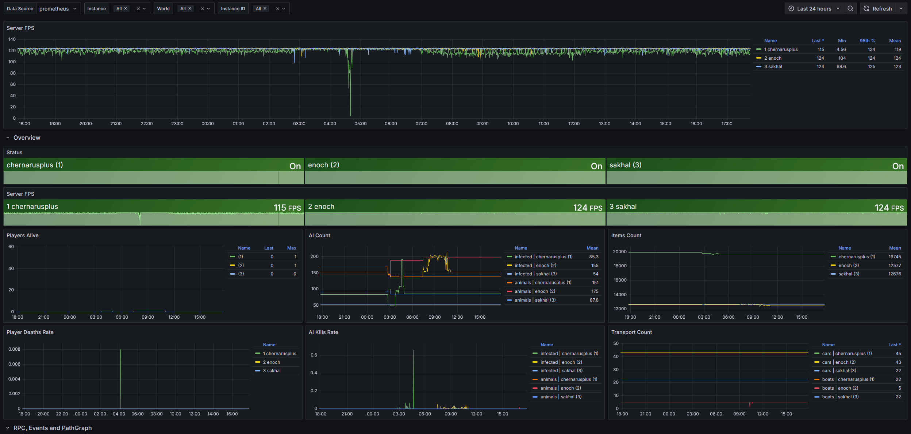
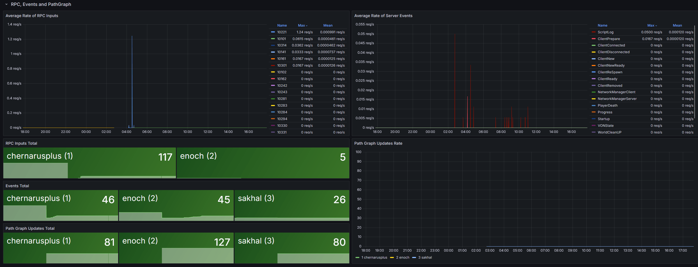
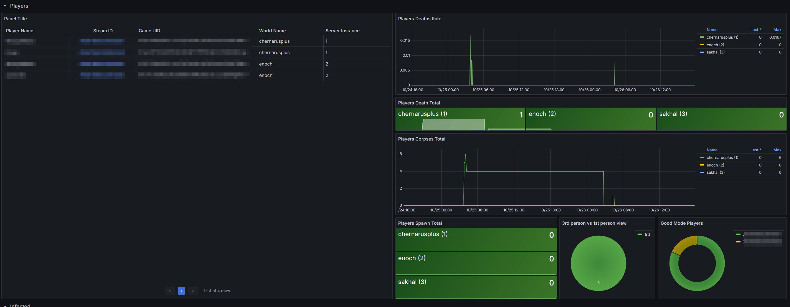
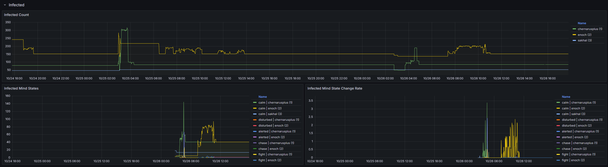
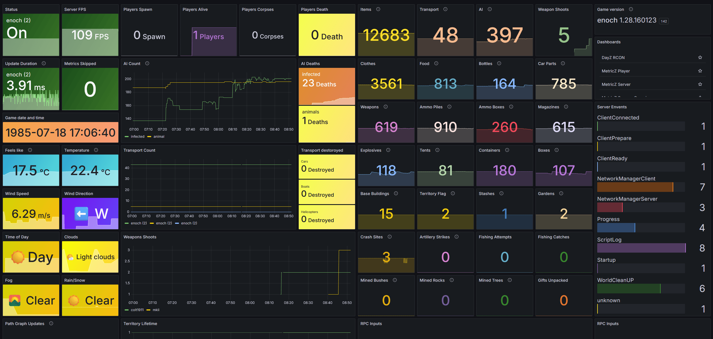
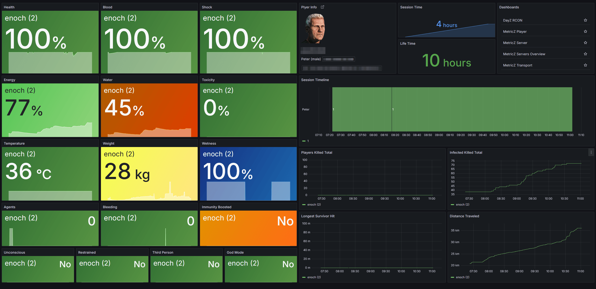

# MetricZ for DayZ Server

<!-- markdownlint-disable-next-line MD033 -->


DayZ server instrumentation via the Prometheus textfile collector. The mod
gathers engine and world metrics and writes atomically to
`$profile:metricz.prom`. Integrates with node_exporter (Linux) or
windows_exporter (Windows).

## Why

* Observe the server and game loop in DayZ.
* Server-side only. No client required. Works on vanilla servers.
* Low overhead: Mission timer and a single pass over entities per scrape
  tick.
* Safety: atomic writes, switchable metric groups, controlled label
  cardinality.
* Self-hosted: full control over your data.
* Free. Supporting the author is optional.

<!-- markdownlint-disable-next-line MD033 -->
<br clear="right"/>

## Architecture

* Hooks: `DayZGame.OnRPC` and `OnEvent` (RPC/Event), `MissionServer` (init,
  scheduler, FPS), `MissionServer.OnUpdate` (FPS sampling).
* Collectors: player (`MetricZ_PlayerMetrics`), transport
  (`MetricZ_TransportMetrics`), territories (`MetricZ_TerritoryMetrics`),
  weapons/shots (`MetricZ_WeaponStats`), weather/world (`MetricZ_Storage`).
* Writing: first `$profile:metricz.tmp`, then atomic publish to
  `$profile:metricz.prom`.
* Format

  * Prefix: `dayz_metricz_`.
  * Types: GAUGE/COUNTER; COUNTER gets `_total` suffix.
  * Base labels: `world`, `host`, `instance_id`. Status also includes
    `game_version`, `save_version`.

## Quick start

Output file:

* Example profile path: `/dayz-server-dir/profiles/profile_1/metricz.prom`.
* Write period: `MetricZ_ScrapeInterval` seconds (see config).

Example content:

```PromQL
# HELP dayz_metricz_players_online Total players online in the world
# TYPE dayz_metricz_players_online gauge
dayz_metricz_players_online{world="chernarusplus",host="dz01",instance_id="1"} 24
```

Details: [METRICS.md](./METRICS.md)

## Mod configuration

> [!IMPORTANT]  
> On the same host every server must have a unique `instanceId`.  
> If multiple servers run the same map (`world`), time series will collide.  
> Base labels are `{world, host, instance_id}`.
> Ensure `instanceId` is unique per server;
> together with the map name it forms metric identity.

In `serverDZ.cfg` (prefix `MetricZ_`; values `0/1`):

```c
// seconds
MetricZ_InitDelay = 60;
MetricZ_ScrapeInterval = 15;

// switches
MetricZ_DisablePlayerMetrics = 0;
MetricZ_DisableTransportMetrics = 0;
MetricZ_DisableWeaponMetrics = 0;
MetricZ_DisableTerritoryMetrics = 0;
MetricZ_EnableCoordinatesMetrics = 0; // enable consciously
MetricZ_DisableRPCMetrics = 0;
MetricZ_DisableEventMetrics = 0;
```

CLI switches (override config; prefix `metricz-`):

```txt
-metricz-init-delay=60 -metricz-scrape-interval=15 -metricz-enable-coordinates=false -metricz-disable-rpc=false -metricz-disable-event=false
```

More: [CONFIG.md](./CONFIG.md)

> [!WARNING]  
> Frequent creation/removal of vehicles (virtual garage, camo nets, etc.)
> increases the number of time series. The `hash` label encodes persistence.
> Recreated objects without restoring persistent ID = new series.  
> If needed, disable transport metrics: `MetricZ_DisableTransportMetrics = 1`.

### Recommendations

* On busy servers keep scrape interval at 5–10 s or higher.
* If you see a parallel scrape warning, increase the interval.
* Align [node_exporter]/[windows_exporter] scrape interval with
  `MetricZ_ScrapeInterval`. Polling an unchanged file more often has no
  benefit.

## Prometheus integration: Linux

Shared directory with symlinks:

```bash
mkdir -p /dayz-server-dir/profiles/metricz
ln -s ../profile_1/metricz.prom /dayz-server-dir/profiles/metricz/metricz_1.prom
ln -s ../profile_2/metricz.prom /dayz-server-dir/profiles/metricz/metricz_2.prom
ln -s ../profile_3/metricz.prom /dayz-server-dir/profiles/metricz/metricz_3.prom
```

Access for node_exporter:

```bash
usermod -aG dayz-server prometheus  # if required
```

Start node_exporter:

```bash
/usr/local/bin/node_exporter \
  --collector.textfile.directory=/dayz-server-dir/profiles/metricz
```

`prometheus.yml` snippet:

```yaml
scrape_configs:
  - job_name: node
    static_configs:
      - targets: ['node-exporter-host:9100']
```

## Prometheus integration: Windows

Profile paths, example:

```txt
C:\dayz-server\profiles\profile_1\metricz.prom
```

Shared directory with links:

```cmd
mkdir C:\dayz-server\profiles\metricz
mklink C:\dayz-server\profiles\metricz\metricz_1.prom C:\dayz-server\profiles\profile_1\metricz.prom
mklink C:\dayz-server\profiles\metricz\metricz_2.prom C:\dayz-server\profiles\profile_2\metricz.prom
mklink C:\dayz-server\profiles\metricz\metricz_3.prom C:\dayz-server\profiles\profile_3\metricz.prom
```

Admin rights required. Alternative: scheduled copy instead of links.

`windows_exporter` (textfile):

### MSI

```powershell
msiexec /i windows_exporter.msi --% ENABLED_COLLECTORS="[defaults],textfile" `
  TEXTFILE_DIRS="C:\dayz-server\profiles\metricz"
```

### YAML

```yaml
collectors:
  enabled: "[defaults],textfile"
collector:
  textfile:
    directories:
      - "C:\\dayz-server\\profiles\\metricz"
```

`prometheus.yml` snippet:

```yaml
scrape_configs:
  - job_name: windows
    static_configs:
      - targets: ['windows-exporter-host:9182']
```

## Dashboards (Grafana)

<!-- TODO -->

| MetricZ Servers Overview                                    |
| :---------------------------------------------------------: |
|                |
|                |
|                |
|                |
| [grafana.com](https://grafana.com/grafana/dashboards/24291) |
| Dashboard ID: `24291`                                       |
| [Dashboard JSON](./grafana/servers-overview.json)           |

---

| MetricZ Server Details                                      |
| :---------------------------------------------------------: |
|                             |
| [grafana.com](https://grafana.com/grafana/dashboards/24290) |
| Dashboard ID: `24290`                                       |
| [Dashboard JSON](./grafana/server.json)                     |

---

| MetricZ Player Stats                                        |
| :---------------------------------------------------------: |
|                             |
| [grafana.com](https://grafana.com/grafana/dashboards/24289) |
| Dashboard ID: `24289`                                       |
| [Dashboard JSON](./grafana/player.json)                     |

---

| MetricZ Transport Stats                                     |
| :---------------------------------------------------------: |
|                        |
| [grafana.com](https://grafana.com/grafana/dashboards/24292) |
| Dashboard ID: `24292`                                       |
| [Dashboard JSON](./grafana/transport.json)                  |

## Debugging

* Enable `-dologs` and `-filePatching` if needed.
* For detailed tracing use `DayZDiag_x64.exe` and a build with `DIAG` to get
  `INFO` logs from the code.

## 👉 [Support Me](https://gist.github.com/WoozyMasta/7b0cabb538236b7307002c1fbc2d94ea)
